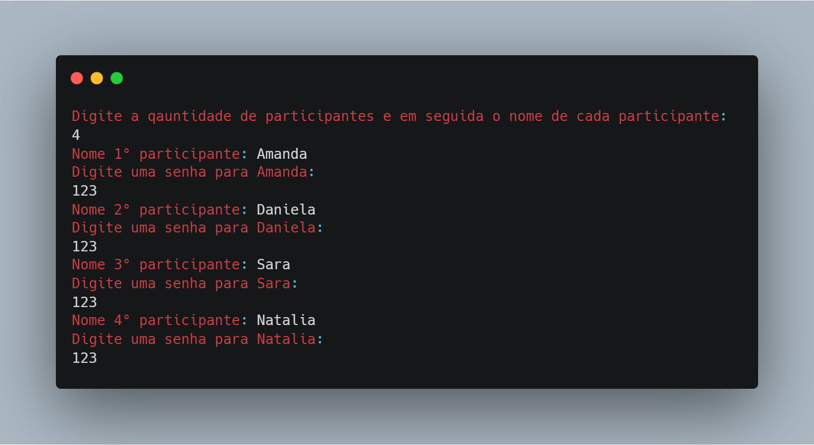
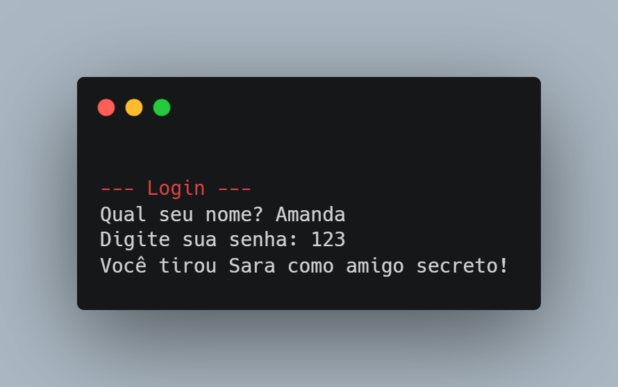

# Sistema de Amigo Secreto
Este sistema de Amigo Secreto permite que você cadastre participantes, sorteie os amigos secretos e faça a validação de login através de senha. O participante precisa fornecer seu nome e senha para acessar o sistema e visualizar quem ele tirou como amigo secreto.

## Funcionalidades
- **Cadastro de Participantes:** O sistema permite que você cadastre um número de participantes e forneça uma senha para cada um.
- **Sorteio do Amigo Secreto:** O sistema sorteia aleatoriamente quem é o amigo secreto de quem, garantindo que ninguém tire a si mesmo e que cada pessoa tenha apenas um amigo secreto.
- **Login com Senha:** O participante precisa se autenticar através do seu nome e senha. Caso a senha esteja correta, ele pode ver quem foi o seu amigo secreto.
- **Validação de Senha:** Caso o participante insira um nome ou senha incorretos, o sistema solicitará uma nova tentativa.

## Como Utilizar
### 1. Cadastro de Participantes
Ao iniciar o programa, você será solicitado a digitar o número de participantes e o nome de cada um deles. Para cada participante, será necessário definir uma senha única.

### 2. Sorteio de Amigos Secretos
Após o cadastro, o sistema realiza o sorteio de amigos secretos. Nenhuma pessoa pode tirar a si mesma e todos os amigos secretos são sorteados aleatoriamente.

### 3. Login e Visualização do Amigo Secreto
Após o sorteio, o participante precisa fazer login utilizando seu nome e senha cadastrados. Se o nome e a senha estiverem corretos, o sistema exibirá quem foi o seu amigo secreto.
### Exemplo de Execução
#### Passo 1: Cadastro de Participantes

####Passo 2: Sorteio dos Amigos Secretos
O sistema sorteia aleatoriamente os amigos secretos, garantindo que ninguém tire a si mesmo.

#### Passo 3: Login

## Como Executar o Código
1. Baixe o código em seu computador.
2. Compile e execute a classe AmigoSecreto utilizando um ambiente Java adequado.
3. Durante a execução, siga as instruções no terminal para cadastrar participantes, realizar o sorteio e fazer o login.

## Tecnologias Utilizadas
- **Java:** Linguagem de programação utilizada para o desenvolvimento.
- **Estruturas de Dados:** Utilizamos arrays e listas para armazenar os participantes e realizar o sorteio.

## Possíveis Melhorias
- **Armazenamento em Arquivo:** Atualmente, os dados são armazenados em memória. É possível salvar os dados em um arquivo para persistência entre execuções.
- **Interface Gráfica:** Adicionar uma interface gráfica para facilitar a interação do usuário
